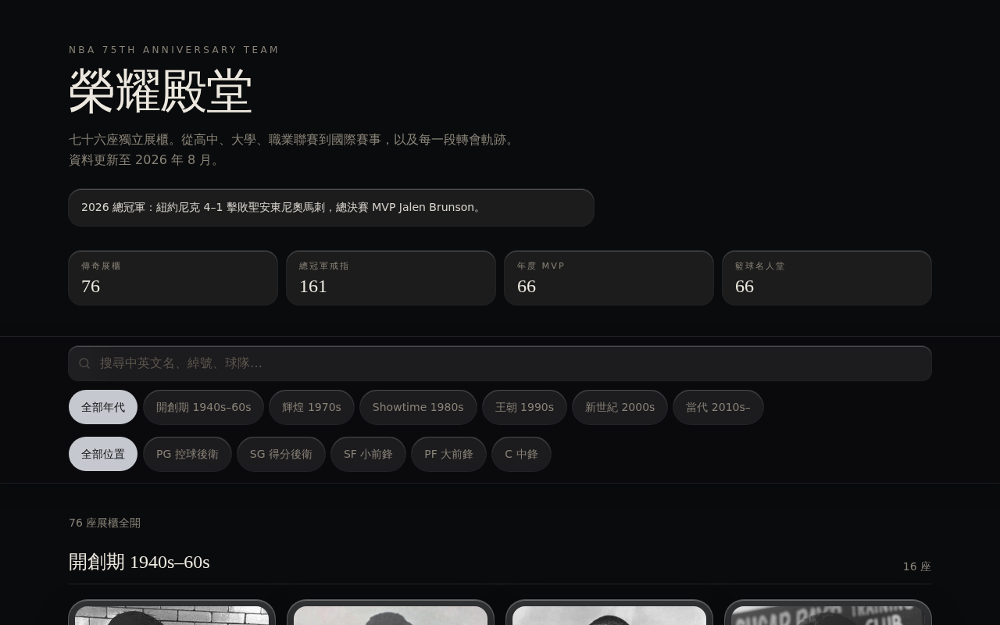

# NBA 75 榮耀殿堂
https://island-hazel-orbit-granite.grok.me/
**繁體中文** fan museum for the [NBA 75th Anniversary Team](https://en.wikipedia.org/wiki/NBA_75th_Anniversary_Team).

七十六座獨立展櫃。從高中、大學、職業聯賽到國際賽事，以及每一段轉會軌跡。資料更新至 **2026 年 8 月**。

> 非官方粉絲專案。NBA、球隊名與球星形象為其權利人所有，本站僅作紀錄與展示。



## 特色

- **76 座展櫃**：NBA 75 大巨星一人一櫃，含肖像、球衣配色與巔峰球隊
- **榮譽年表**：高中 → 大學 → NBA（總冠軍、FMVP、MVP、防守、全明星、年度隊、得分王、退役球衣、名人堂）→ 國際賽
- **轉會軌跡**：效力路徑與交易說明
- **現役／代表隊**：現役標最後一站，退役標生涯代表隊
- **搜尋與篩選**：姓名、綽號、球隊；依年代與位置分廳
- **毛玻璃博物館 UI**：展櫃玻璃、frosted plate、肖像 vitrine

## 技術棧

| 層 | 選用 |
| --- | --- |
| UI | React 19、TanStack Router / Start、Tailwind CSS v4 |
| 元件 | Radix UI、lucide-react |
| 資料 | 靜態 TypeScript（無需帳號、無需資料庫） |
| 建置 | Vite 8、Node 22 |

## 快速開始

需要 [Node.js 22](https://nodejs.org/) 與 npm。

```bash
git clone https://github.com/richie7p/nba-75-hall.git
cd nba-75-hall
npm install
npm run dev
```

瀏覽器開啟提示的本機網址（預設埠 `8080`）。

```bash
npm run typecheck   # TypeScript
npm run build       # 正式建置
```

## 專案結構

```text
src/
  data/
    types.ts          球員、榮譽、轉會型別
    players-a.ts      巨星資料（A–J）
    players-b.ts      巨星資料（K–Z）
    photos.ts         本地肖像路徑
    index.ts          PLAYERS、DATA_AS_OF
  components/
    cabinet.tsx       殿堂展櫃卡
    portrait.tsx      肖像（球衣 fallback）
    jersey.tsx        球衣號
  routes/
    index.tsx         殿堂大廳、搜尋、年代廳
    player.$id.tsx    單人展櫃
  lib/hall.ts         篩選、統計、現役／名人堂文案
public/portraits/     76 張球員照片
```

每位巨星的資料形狀見 [`src/data/types.ts`](src/data/types.ts)。新增或勘誤請改 `players-a.ts` / `players-b.ts`，並同步 `DATA_AS_OF`。

## 資料說明

- 榮譽次數為生涯匯總，不是逐年名單。
- 2026 現役八人：Leonard、Lillard、Antetokounmpo、Curry、Davis、Durant、Harden、James。
- 肖像取自公開來源縮圖，僅供展示。

## License

MIT。內容與商標仍歸原權利人。
